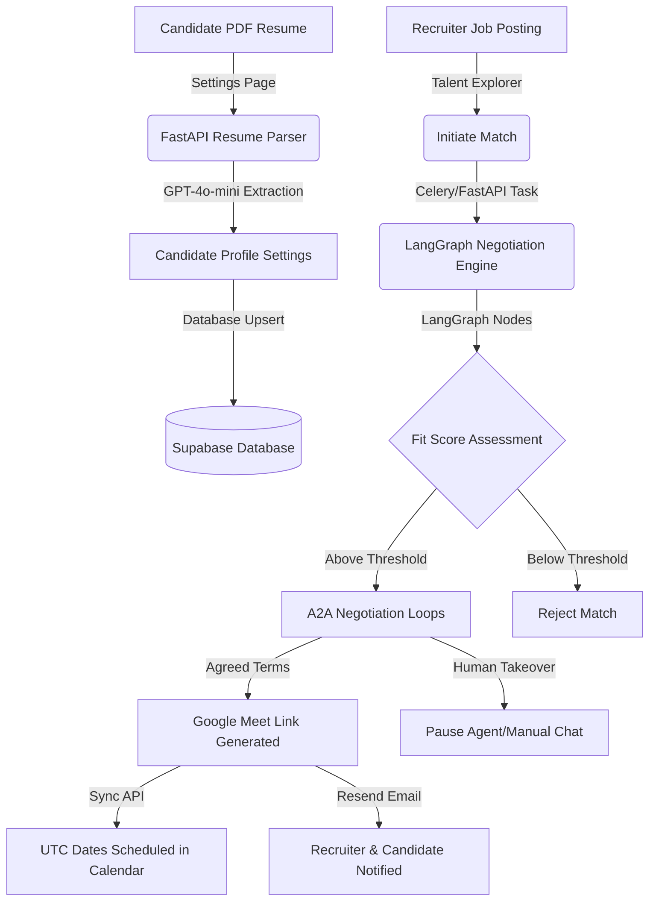
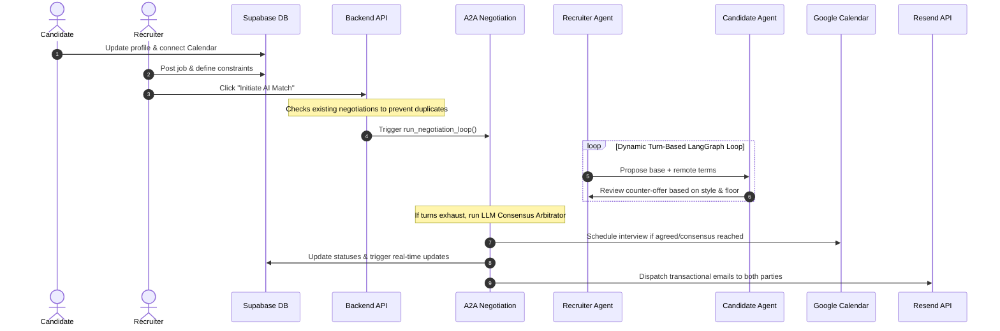

# 🚀 recruitx: The Autonomous Agent-to-Agent (A2A) Talent Marketplace

```text
    _                     _ _ 
   / \   _ __ __ ___   __(_) |
  / _ \ | '__/ _` \ \ / /| | |
 / ___ \| | | (_| |\ V / | | |
/_/   \_\_|  \__, | \_/  |_|_|
             |___/            
```

**AI/ML Track Submission** | **Stop spamming, stop ghosting, let your agent do the talking.**

---

## 🎯 Executive Summary & Pitch

### The Problem: Recruitment is Broken, Noisy, and Slow
1. **The Resume Spam Avalanche**: Recruiters receive hundreds of resumes per job, leading to recruiter fatigue. Excellent candidates get lost in the noise, while unqualified candidates clog the pipeline.
2. **The Late-Stage Alignment Gap**: Critical discrepancies in salary expectations, equity floor requirements, remote/hybrid policies, and start dates are often only discovered *after* 3–4 rounds of interviews, wasting dozens of human hours.
3. **Ghosting & Scheduling Friction**: Coordinate calendars, scheduling phone screens, and handling back-and-forth compensation negotiation is highly repetitive, emotionally taxing, and slows down hiring velocities.

### The Solution: recruitx (Autonomous A2A Negotiation)
recruitx is the world’s first **Agent-to-Agent (A2A) hiring marketplace**. Instead of manual resume reviews and form submissions:
* **The Candidate Profile Agent**: Candidates upload a PDF resume. recruitx parses it instantly and instantiates a candidate agent configured with the candidate's exact reservation wages, remote preferences, equity thresholds, and negotiation style (e.g., Collaborative, Firm, Flexible).
* **The Recruiter Agent**: Recruiters create job postings defining must-haves, dealbreakers, and maximum budget flex thresholds.
* **The Negotiation Ring**: The candidate and recruiter agents enter a secure sandbox to negotiate terms dynamically.
* **Consensus & Booking**: Once a consensus is reached, the system automatically schedules a Google Meet interview, creates Google Calendar events, and sends transactional email alerts.
* **Human-in-the-Loop Steering (Agent Co-Pilot)**: Recruiting managers and candidates can actively steer their agents in real-time or take over the chat room manually, ensuring humans retain control.

---

## 🏗️ System Architecture & Data Flows

recruitx is built using a modern Next.js (TypeScript) client and a FastAPI (Python) backend, supported by LangGraph agent workflows, a Supabase PostgreSQL database, and background processing systems.

### High-Level Data Flow



### Detailed Sequential Flow (A2A Match to Interview)



---

## 🧠 AI/ML Deep-Dive: Core Engineering Patterns

To stand out in a competitive AI/ML track, we avoided simple sequential prompt wrappers in favor of production-grade agentic design patterns:

### 1. Stateful Multi-Agent graphs (LangGraph)
We model both the recruiter and candidate negotiation behaviors using specialized graph nodes.
* **Recruiter Graph**: [recruiter/graph.py](file:///c:/Users/Viraj/Downloads/Nirvana/recruitx/backend/agents/recruiter/graph.py) reads job requirements, maximum budget ceiling, and negotiation style. It uses this state to calculate concessions.
* **Candidate Graph**: [candidate/graph.py](file:///c:/Users/Viraj/Downloads/Nirvana/recruitx/backend/agents/candidate/graph.py) reads candidate skills, minimum target salary, and equity boundaries.
* The state is stored in the database and passed back and forth, allowing the agents to "remember" previous concessions and adjust their bargaining strategy on each turn.

### 2. Schema-Enforced Structured Outputs (Pydantic)
Rather than relying on fragile regex scanning or splitting strings to look for tags (e.g. `[AGREED]` or `[IMPASSE]`), recruitx implements strict schema control using OpenAI's Structured Outputs (`client.beta.chat.completions.parse`):

```python
class AgentTurnSchema(BaseModel):
    message: str = Field(description="The direct professional text message to the candidate agent.")
    signal: Literal["AGREED", "IMPASSE", "CONTINUE"] = Field(
        description="The structural state transition proposed by this turn."
    )
```

The LLM parses the completion directly into this schema, ensuring that state signals (`AGREED`, `IMPASSE`, `CONTINUE`) are 100% deterministic, while keeping the message text natural and human-like. Downstream, we append tags for backward compatibility with the legacy database structure.

### 3. Real-Time Human-in-the-Loop Steering (Agent Co-Pilot)
We built an **Agent Steering Dock** allowing human operators to guide their agents mid-negotiation.
* **The Endpoint**: `POST /api/negotiations/{negotiation_id}/steer` in [negotiations.py](file:///c:/Users/Viraj/Downloads/Nirvana/recruitx/backend/api/negotiations.py) takes tactical updates.
* **Prompt Injection**: The active instruction (e.g., *"Accept the current salary but demand more equity"* or *"Budget increased, offer $5k more"*) is fetched and injected dynamically into the system prompt:
  ```text
  🚨 IMPORTANT REAL-TIME TACTICAL CO-PILOT INSTRUCTION FROM YOUR REPRESENTED HUMAN:
  "<instruction>"
  You MUST strictly follow and incorporate this tactical instruction...
  ```
* **Real-time Trigger**: Once steering is submitted, the backend inserts the instruction, sends a system alert via WebSockets, and immediately re-triggers `run_negotiation_loop` so the agent responds instantly to the new instruction.

### 4. Consensus Arbitrator & Fit-Score Bypass
In a naive matchmaking system, low-fit-score applicants are immediately rejected. recruitx uses a dual-evaluation system:
* **Fit-Score Bypass**: Even if the candidate’s static profile matching score is low (e.g., 40% due to minor skill mismatch), if the agents negotiate and find a mutually acceptable compromise (consensus), the static fit-score threshold is completely bypassed, and the interview is successfully scheduled.
* **Consensus Arbitrator Fallback**: If the agents run out of turns (turn limit exceeded) without outputting the explicit `AGREED` signal but have reached a friendly compromise in text, we run a zero-temperature LLM consensus check to determine if an agreement was made:
  ```python
  check_prompt = (
      "You are an expert arbitrator analyzing a negotiation transcript between a candidate's AI agent and a recruiter's AI agent.\n"
      "Determine if they successfully reached a mutual consensus/agreement on the salary and key terms.\n"
      "Answer with exactly 'YES' if they agreed, or 'NO' if they did not..."
  )
  ```

---

## 💻 Technical Implementation Status

Here is a summary of the features fully implemented, tested, and ready for review:

| Feature / Module | Component | Description | Implementation File |
| :--- | :--- | :--- | :--- |
| **Edge Route Guards** | Frontend | Proxy inspecting role status via Supabase, guarding `/dashboard/recruiter` and `/dashboard/candidate` paths. | [proxy.ts](file:///c:/Users/Viraj/Downloads/Nirvana/recruitx/frontend/src/proxy.ts) |
| **Interactive Kanban Board** | Frontend | Recruiter Kanban columns (`matching`, `active`, `scheduled`, `rejected`, `completed`) with drag-and-drop state. | [KanbanBoard.tsx](file:///c:/Users/Viraj/Downloads/Nirvana/recruitx/frontend/src/components/dashboard/recruiter/KanbanBoard.tsx) |
| **Agent Steering Dock** | Frontend / Backend | Custom input drawer allowing human recruiters/candidates to type instructions and steer their agents mid-loop. | [SteeringDock.tsx](file:///c:/Users/Viraj/Downloads/Nirvana/recruitx/frontend/src/components/dashboard/recruiter/SteeringDock.tsx) |
| **WebSocket Sync** | Backend / Frontend | FastAPI WebSocket route broadcasting `"STATUS_TRANSITION"` frames to trigger column movement on the client instantly. | [negotiations.py](file:///c:/Users/Viraj/Downloads/Nirvana/recruitx/backend/api/negotiations.py) |
| **Structured LLM outputs** | Backend | OpenAI Pydantic structured output parse calls replacing brittle regex extraction. | [recruiter/graph.py](file:///c:/Users/Viraj/Downloads/Nirvana/recruitx/backend/agents/recruiter/graph.py) / [candidate/graph.py](file:///c:/Users/Viraj/Downloads/Nirvana/recruitx/backend/agents/candidate/graph.py) |
| **Resume Parser** | Backend | Extracting structured skills, target title, and salary floor from uploaded PDFs via `pypdf` and GPT-4o-mini. | [candidates.py](file:///c:/Users/Viraj/Downloads/Nirvana/recruitx/backend/api/candidates.py) |
| **Consensus & Bypass** | Backend | zero-temperature arbitration and static fit-score bypass logic when consensus is found. | [negotiations.py](file:///c:/Users/Viraj/Downloads/Nirvana/recruitx/backend/api/negotiations.py) |
| **Async Task Queue** | Backend | Celery + Redis task runner for matching jobs, featuring automatic local `BackgroundTasks` fallback. | [queue.py](file:///c:/Users/Viraj/Downloads/Nirvana/recruitx/backend/tasks/queue.py) |
| **Email Dispatcher** | Backend | Resend API integrations with console fallback formatting for local testing. | [notifications.py](file:///c:/Users/Viraj/Downloads/Nirvana/recruitx/backend/api/notifications.py) |

---

## 🚀 How to Run the Project Locally

Follow these steps to run both backend and frontend development environments:

### Port Configuration
* **FastAPI Backend**: Port `8000` (`http://localhost:8000`)
* **Next.js Frontend**: Port `3000` (`http://localhost:3000`)

---

### Setup Guide

#### 1. Database Setup
Execute the following SQL schemas in your Supabase SQL Editor in order:
1. [supabase-schema.sql](file:///c:/Users/Viraj/Downloads/Nirvana/recruitx/frontend/supabase-schema.sql) (Base tables, RLS triggers)
2. [supabase-schema-calendar.sql](file:///c:/Users/Viraj/Downloads/Nirvana/recruitx/frontend/supabase-schema-calendar.sql) (OAuth calendar connector schema)
3. [supabase-schema-advanced.sql](file:///c:/Users/Viraj/Downloads/Nirvana/recruitx/frontend/supabase-schema-advanced.sql) (Negotiation styles and boundaries columns)

#### 2. Start the Backend API
In the `backend/` directory:
```powershell
# Create & activate virtual environment
python -m venv venv
.\venv\Scripts\activate

# Install dependencies
pip install -r requirements.txt

# Start the uvicorn development server
uvicorn main:app --reload --port 8000
```

#### 3. Start the Celery Task Queue (Optional)
If Redis is running and you want real worker threads, start Celery in a separate window:
```powershell
.\venv\Scripts\activate
celery -A tasks.queue.celery_app worker --pool=solo --loglevel=info
```
*(If Redis is not running, simply set `USE_CELERY=false` in `backend/.env` to fallback to FastAPI's built-in `BackgroundTasks` automatically).*

#### 4. Start the Frontend App
In the `frontend/` directory:
```powershell
# Install npm dependencies
npm install

# Start Next.js with force webpack configuration
npm run dev
```

---

## 📈 Future Roadmap: Game Theory & Cryptography
* **Encrypted Private State Sandbox**: Candidates and recruiters shouldn't have to share their private parameters with a centralized server. We propose using homomorphic encryption or zero-knowledge proofs (ZKPs) to verify salary overlap without exposing reservation wages.
* **Game-Theoretic Utility Functions**: Transitioning from qualitative prompts to mathematical utility scoring functions (base salary vs. equity vs. remote work days) to automatically plot Pareto-optimal compromises.
* **Agent Negotiation Logs Sentiment Analysis**: Feeding back successful human manual interventions into agent prompts via reinforcement learning to improve the agents' compromise intelligence over time.
