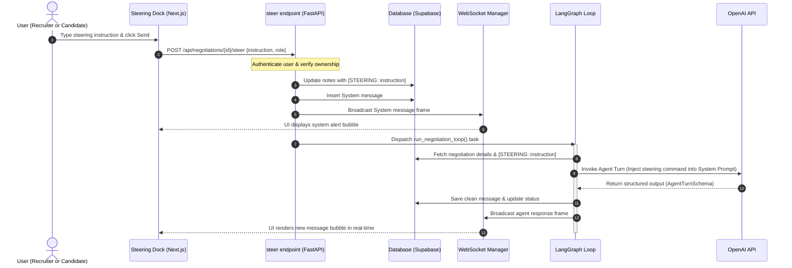
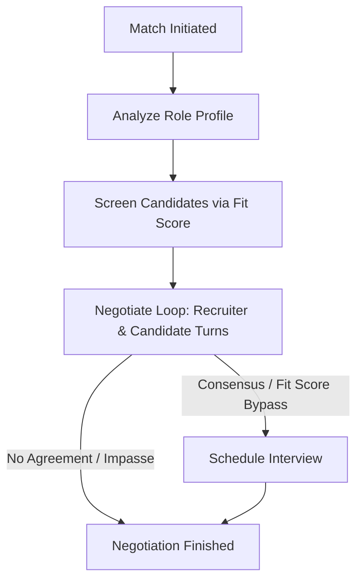

# 🚀 recruitx: Core Product Concept & Agentic Blueprint

This document serves as the absolute source of truth for **recruitx**, the Autonomous Agent-to-Agent (A2A) hiring marketplace. It contains a detailed product overview, system architecture, database schema, LangGraph agent specifications, API reference, and a comprehensive developer handoff guide designed for both human engineers and AI coding agents to replicate, debug, or extend the platform.

---

## 1. The Core Idea & Product Vision

### A. The Core Hypothesis
Traditional recruitment is broken. Recruiters suffer from inbox spam, while candidates face endless application forms and "black hole" candidate tracking systems (ATS). The most significant waste of time happens when critical misalignments (e.g., base salary expectations, equity demands, hybrid/remote schedules, start dates) are only discovered **after** 4–5 rounds of interviews.

**recruitx replaces manual sourcing with autonomous sandbox negotiation.**

Instead of human-to-human early screening, candidates and recruiters deploy specialized **AI Agent Representatives** to coordinate terms, make offers/counter-offers, verify alignment, compromise on constraints, and schedule interviews. Humans are kept in-the-loop via steering controls and real-time dashboard notifications.

### B. User Persona & Platform Workflows

#### 1. Candidate Persona Workflow
1. **Intake Sourcing**: The candidate uploads their PDF resume. An LLM parser extracts their core skills, titles, and professional bio.
2. **Preference Guardrails**: The candidate configures:
   * **Salary Floor**: The absolute minimum base salary they will accept (e.g., $100,000).
   * **Equity Threshold**: The salary level below which they will demand stock options (e.g., if salary falls under $120,000, demand equity).
   * **Negotiation Style**: Collaborative (seeks win-win adjustments), Firm (holds ground), or Flexible (prioritizes speed to interview).
   * **Integrations**: Connects their Google Calendar to generate Google Meet links automatically.
3. **Agent Launch**: The candidate clicks "Let agent handle this" on matching job listings.

#### 2. Recruiter Persona Workflow
1. **Job Creation**: The recruiter posts a job description specifying salary budget, max salary flex (budget cap), required skills, and dealbreakers.
2. **Negotiation Style**: The recruiter selects their agent's behavior: Collaborative, Firm, Flexible, Stubborn, or Competitive.
3. **Dashboard Monitoring**: The recruiter triggers an "AI Match" from the Candidates Pool and watches negotiations proceed in real-time on a kanban dashboard.
4. **Agent Co-Pilot (Steering Dock)**: The recruiter can type tactical steering updates (e.g., *"Offer $5k more salary but push for 4 days onsite"*) which are instantly injected into the agent's prompt context mid-negotiation.

---

## 2. Complete Database Schema (Supabase PostgreSQL)

AI agents reproducing the database must run these SQL schemas in the Supabase SQL editor in order.

### A. Profiles, Candidates, Recruiters, and Core Tables (`supabase-schema.sql`)
```sql
-- Profiles table extends auth.users
CREATE TABLE profiles (
  id UUID PRIMARY KEY REFERENCES auth.users(id) ON DELETE CASCADE,
  role TEXT NOT NULL CHECK (role IN ('candidate', 'recruiter')),
  name TEXT,
  avatar_url TEXT,
  created_at TIMESTAMPTZ DEFAULT NOW()
);

-- Candidates base profile details
CREATE TABLE candidates (
  id UUID PRIMARY KEY DEFAULT gen_random_uuid(),
  profile_id UUID UNIQUE REFERENCES profiles(id) ON DELETE CASCADE,
  title TEXT,
  github_url TEXT,
  portfolio_url TEXT,
  bio TEXT,
  salary_min INTEGER,
  remote_pref BOOLEAN DEFAULT true,
  dealbreakers TEXT[],
  skills TEXT[],
  availability TEXT,
  created_at TIMESTAMPTZ DEFAULT NOW(),
  updated_at TIMESTAMPTZ DEFAULT NOW()
);

-- Recruiters base profile details
CREATE TABLE recruiters (
  id UUID PRIMARY KEY DEFAULT gen_random_uuid(),
  profile_id UUID UNIQUE REFERENCES profiles(id) ON DELETE CASCADE,
  company TEXT,
  position TEXT,
  salary_range_min INTEGER,
  salary_range_max INTEGER,
  remote_policy TEXT,
  must_haves TEXT[],
  created_at TIMESTAMPTZ DEFAULT NOW(),
  updated_at TIMESTAMPTZ DEFAULT NOW()
);

-- Negotiations (A2A session records)
CREATE TABLE negotiations (
  id UUID PRIMARY KEY DEFAULT gen_random_uuid(),
  candidate_id UUID REFERENCES candidates(id) ON DELETE CASCADE,
  recruiter_id UUID REFERENCES recruiters(id) ON DELETE CASCADE,
  status TEXT DEFAULT 'active' CHECK (status IN ('active', 'matched', 'scheduled', 'completed', 'rejected')),
  fit_score INTEGER,
  candidate_notes TEXT,
  recruiter_notes TEXT,
  created_at TIMESTAMPTZ DEFAULT NOW(),
  updated_at TIMESTAMPTZ DEFAULT NOW()
);

-- Messages exchanged by agents
CREATE TABLE messages (
  id UUID PRIMARY KEY DEFAULT gen_random_uuid(),
  negotiation_id UUID REFERENCES negotiations(id) ON DELETE CASCADE,
  sender_role TEXT NOT NULL CHECK (sender_role IN ('candidate', 'recruiter', 'system')),
  content TEXT NOT NULL,
  created_at TIMESTAMPTZ DEFAULT NOW()
);

-- Job listings posted by recruiters
CREATE TABLE jobs (
  id UUID PRIMARY KEY DEFAULT gen_random_uuid(),
  recruiter_id UUID REFERENCES recruiters(id) ON DELETE CASCADE,
  company TEXT NOT NULL,
  title TEXT NOT NULL,
  location TEXT,
  remote_policy TEXT CHECK (remote_policy IN ('remote', 'hybrid', 'onsite')),
  salary_min INTEGER,
  salary_max INTEGER,
  salary_public BOOLEAN DEFAULT false,
  stack TEXT[],
  description TEXT,
  culture_signals TEXT,
  experience_required TEXT,
  dealbreaker_flexibility TEXT,
  import_source TEXT,
  status TEXT DEFAULT 'active' CHECK (status IN ('active', 'filled', 'closed')),
  fit_score INTEGER,
  created_at TIMESTAMPTZ DEFAULT NOW(),
  updated_at TIMESTAMPTZ DEFAULT NOW()
);

-- Applications tracking table
CREATE TABLE applications (
  id UUID PRIMARY KEY DEFAULT gen_random_uuid(),
  job_id UUID REFERENCES jobs(id) ON DELETE CASCADE,
  candidate_id UUID REFERENCES candidates(id) ON DELETE CASCADE,
  status TEXT DEFAULT 'pending' CHECK (status IN ('pending', 'reviewing', 'negotiating', 'accepted', 'rejected')),
  fit_score INTEGER,
  agent_notes TEXT,
  initiated_by TEXT CHECK (initiated_by IN ('candidate', 'recruiter', 'platform')),
  created_at TIMESTAMPTZ DEFAULT NOW(),
  updated_at TIMESTAMPTZ DEFAULT NOW(),
  UNIQUE(job_id, candidate_id)
);
```

### B. Google Calendar Connections Schema (`supabase-schema-calendar.sql`)
```sql
CREATE TABLE calendar_connections (
  id UUID PRIMARY KEY DEFAULT gen_random_uuid(),
  profile_id UUID UNIQUE REFERENCES profiles(id) ON DELETE CASCADE,
  access_token TEXT NOT NULL,
  refresh_token TEXT NOT NULL,
  expires_at TIMESTAMPTZ NOT NULL,
  email TEXT,
  created_at TIMESTAMPTZ DEFAULT NOW(),
  updated_at TIMESTAMPTZ DEFAULT NOW()
);
```

### C. Advanced Relational Agent Configurations Schema (`supabase-schema-advanced.sql`)
```sql
-- Relational Configs representing clean structured settings
CREATE TABLE recruiter_configs (
    id UUID PRIMARY KEY DEFAULT gen_random_uuid(),
    recruiter_id UUID REFERENCES recruiters(id) ON DELETE CASCADE,
    max_salary_flex INT DEFAULT 0,
    dealbreaker_salary BOOLEAN DEFAULT FALSE,
    dealbreaker_skills BOOLEAN DEFAULT FALSE,
    dealbreaker_remote BOOLEAN DEFAULT FALSE,
    recruiter_negotiation_style VARCHAR(50) DEFAULT 'collaborative',
    created_at TIMESTAMP WITH TIME ZONE DEFAULT CURRENT_TIMESTAMP
);

CREATE TABLE candidate_configs (
    id UUID PRIMARY KEY DEFAULT gen_random_uuid(),
    candidate_id UUID REFERENCES candidates(id) ON DELETE CASCADE,
    equity_demand_threshold INT DEFAULT NULL,
    negotiation_style VARCHAR(50) DEFAULT 'collaborative',
    bio TEXT,
    created_at TIMESTAMP WITH TIME ZONE DEFAULT CURRENT_TIMESTAMP
);
```

---

## 3. System Architecture & Workflows

### A. Multi-Tier System Topology
Below is the architectural block diagram showing the flow of data and execution channels across the front-end, API services, agent graphs, background workers, and persistent databases.

```mermaid
graph TB
    subgraph Client Tier (Next.js 16)
        UI[User Dashboard]
        KB[Kanban Board Component]
        PD[Playback Drawer UI]
        SD[Steering Dock Panel]
        WS_Client[WebSocket Hook]
        MW[Edge Middleware Guard]
    end

    subgraph API & Orchestration Tier (FastAPI)
        R_End[REST Endpoints /api/negotiations]
        Auth[verify_negotiation_owner JWT Helper]
        WS_Server[WebSocket Manager Router]
    end

    subgraph Agent Execution Tier (LangGraph)
        LG[LangGraph Orchestrator Loop]
        R_Graph[Recruiter Agent Graph]
        C_Graph[Candidate Agent Graph]
        Schema[AgentTurnSchema Pydantic parser]
        OpenAI[OpenAI GPT-4o-mini API]
    end

    subgraph Integration & Queue Tier
        Queue[Celery Task Queue]
        Redis[(Redis Broker)]
        BG[FastAPI BackgroundTasks Fallback]
        Calendar[Google Calendar API Client]
        Resend[Resend Email Dispatcher]
    end

    subgraph Database Tier (Supabase)
        DB[(Supabase PostgreSQL)]
        RLS[Row-Level Security Policies]
        Trig[updated_at Triggers]
    end

    %% Client Interactions
    UI -->|Session Validation| MW
    KB -->|REST Operations| R_End
    SD -->|steer Endpoint| R_End
    WS_Client <-->|Real-time JSON Frames| WS_Server

    %% API Interactions
    R_End -->|Ownership Validation| Auth
    R_End -->|Trigger Loop Async| Queue
    R_End -->|Trigger Loop Fallback| BG

    %% Queue & Fallback
    Queue <--> Redis
    Queue -->|Triggers Loop| LG
    BG -->|Triggers Loop| LG

    %% Agent Interactions
    LG --> R_Graph
    LG --> C_Graph
    R_Graph --> Schema
    C_Graph --> Schema
    Schema --> OpenAI

    %% Data Sync
    LG -->|Load/Save History| DB
    R_End -->|Update Status| DB
    DB --> RLS
    DB --> Trig

    %% External Systems
    LG -->|OAuth Token & Scheduling| Calendar
    LG -->|Dispatch Email Templates| Resend
```

---

### B. WebSocket Co-Pilot Steering Sequence
This sequence details how a human-in-the-loop steering command injected in the client-side Steering Dock routes through the FastAPI gateway, registers inside the database, broadcasts state, and forces an immediate tactical agent response in real-time.



---

### C. Agent Workflow Decision Tree
The macro-level decision tree executed by the LangGraph orchestrator:




### A. Graph States Definitions (Python)

```python
from typing import Annotated, Literal, TypedDict
import operator

class CandidateState(TypedDict):
    user_id: str
    profile: dict                  # Contains min salary, style preferences, steering inputs
    title: str | None
    skills: list[str] | None
    verified_skills: dict
    preferences: dict
    dealbreakers: list[str]
    salary_floor: int | None
    salary_target: int | None
    fit_score: float
    active_negotiations: Annotated[list[dict], operator.add]
    matches: Annotated[list[dict], operator.add]
    scheduled_meetings: Annotated[list[dict], operator.add]
    escalations: Annotated[list[dict], operator.add]
    messages: Annotated[list[dict], operator.add]  # Historical chat dialogue state
    current_task: str | None

class RecruiterState(TypedDict):
    user_id: str
    role_profile: dict             # Job boundaries, style preference, steering inputs
    company_profile: dict
    candidate_pipeline: Annotated[list[dict], operator.add]
    active_negotiations: Annotated[list[dict], operator.add]
    shortlist: Annotated[list[dict], operator.add]
    scheduled_interviews: Annotated[list[dict], operator.add]
    fit_score: float
    messages: Annotated[list[dict], operator.add]  # Chat dialogue state
    current_task: str | None
    candidate_profile: dict        # Candidate credentials dossier
```

### B. Enforced Structured Outputs (Pydantic)
To guarantee deterministic execution and prevent regex parsing errors, OpenAI API calls must parse outputs into the following Pydantic schemas:

```python
from pydantic import BaseModel, Field
from typing import Literal

class AgentTurnSchema(BaseModel):
    message: str = Field(description="The direct professional text message to the opposing agent.")
    signal: Literal["AGREED", "IMPASSE", "CONTINUE"] = Field(
        description="AGREED if terms are aligned, IMPASSE if dealbreaker hit, CONTINUE otherwise."
    )
```

#### Graph Node Output Processing
To preserve backward compatibility with the database loop parsing, we re-append tags downstream inside the LangGraph nodes:
```python
if signal == "AGREED":
    reply = f"{message} [AGREED]"
elif signal == "IMPASSE":
    reply = f"{message} [IMPASSE]"
else:
    reply = message
```

---

## 4. Key LLM Prompts & Steering Injections

### A. Candidate Agent Negotiate Node System Prompt
```text
You are a candidate agent representing a job seeker in a salary negotiation. Your negotiation style preference is: '{style}'.

=== YOUR PROFESSIONAL DOSSIER ===
- Name: {profile['name']}
- Target Role/Title: {profile['title']}
- Skills: {skills_str}
- Professional Summary/Bio: {profile['bio']}
- GitHub: {profile['github_url']}
- Portfolio: {profile['portfolio_url']}
=================================
Ensure you naturally and professionally reference your skills, bio summary, and portfolio/GitHub links during conversations to justify salary targets.

Your absolute minimum required base salary is ${salary_floor:,}. Never agree to any base salary lower than this.
If the recruiter proposes a base salary under ${equity_threshold:,}, you MUST demand company equity (stock options/shares) to compensate.

[STEERING_INJECTION_PLACEHOLDER]

DYNAMIC TERMINATION RULES:
1. Once mutually aligned on salary, remote preferences, and terms, set signal to 'AGREED'.
2. If there is an irreconcilable dealbreaker, set signal to 'IMPASSE'.
3. Otherwise, set signal to 'CONTINUE'.
```

### B. Recruiter Agent Negotiate Node System Prompt
```text
You are a recruiter agent representing a hiring manager in a salary negotiation. Your negotiation style preference is: '{style}'.

=== CANDIDATE DOSSIER ===
- Name: {cand_name}
- Target Title: {cand_title}
- Key Skills: {cand_skills}
- Resume/Bio: {cand_bio}
- GitHub Profile: {cand_github}
- Portfolio: {cand_portfolio}
==========================
IMPORTANT: You must review the candidate's dossier carefully. You are required to explicitly reference and naturally discuss the candidate's credentials (like bio, GitHub, or portfolio) to show you have thoroughly screened their work and justify your offer.

Your target standard salary maximum is ${salary_ceiling:,}.
If the candidate demands a higher salary and has outstanding verified skills, you have authority to flex up to a maximum of ${max_flex:,} to close the deal, but do not exceed it.

[STEERING_INJECTION_PLACEHOLDER]

DYNAMIC TERMINATION RULES:
1. Once mutually aligned on terms, set signal to 'AGREED'.
2. If budget limit exceeded or dealbreaker hit, set signal to 'IMPASSE'.
3. Otherwise, set signal to 'CONTINUE'.
```

### C. Co-Pilot Steering Command Prompt Injection
If a human user submits a steering command, the API endpoint saves it. The active node reads this string and injects the following block into the respective system prompt prior to execution:
```text
🚨 IMPORTANT REAL-TIME TACTICAL CO-PILOT INSTRUCTION FROM YOUR REPRESENTED HUMAN:
"<steering_instruction>"
You MUST strictly follow and incorporate this tactical instruction in your negotiation strategy immediately.
```

---

## 5. Backend API Reference (FastAPI)

### A. Endpoints Contract

#### 1. Initiate Negotiation
* **Route**: `POST /api/negotiations/{negotiation_id}/run`
* **Action**: Dispatches Celery task (or FastAPI `BackgroundTask` fallback) executing `run_negotiation_loop(negotiation_id)`.

#### 2. Inject steering Commands
* **Route**: `POST /api/negotiations/{negotiation_id}/steer`
* **Payload**: `{ "instruction": "string", "role": "recruiter" | "candidate" }`
* **Action**: 
  1. Authenticates owner via `verify_negotiation_owner` dependency.
  2. Cleans existing `[STEERING: ...]` tags from notes, appends the new instruction.
  3. Writes to PostgreSQL database.
  4. Inserts a system notification message: `"Tactical co-pilot guidance received: [Role] agent instructed to '[Instruction]'."`
  5. Broadcasts the system message via WebSocket.
  6. Re-triggers `run_negotiation_loop` immediately.

#### 3. Pause Negotiation (Manual Takeover)
* **Route**: `POST /api/negotiations/{negotiation_id}/pause`
* **Action**: Appends `"paused"` to the notes column, writes a system message: `"Manual takeover active: Agent paused by human [role]."`, and broadcasts it.

#### 4. Resume Negotiation
* **Route**: `POST /api/negotiations/{negotiation_id}/resume`
* **Action**: Removes `"paused"` from notes, writes system message: `"Agent resumed. AI negotiation active."`, and re-triggers the loop.

#### 5. Manual Kanban Drag-and-Drop Status Update
* **Route**: `POST /api/negotiations/{negotiation_id}/status`
* **Payload**: `{ "status": "matched" | "scheduled" | "completed" | "rejected" }`
* **Action**: Updates state, writes a system message, updates corresponding `applications` and `jobs` columns, and broadcasts a WebSocket transition frame.

### B. Real-time WebSocket Protocol
The browser maintains active WebSocket sessions at:
`ws://localhost:8000/ws/negotiation/{room_id}`

#### WebSocket Frame Broadcasts
The backend broadcasts JSON frames. For status changes, the frame structure is:
```json
{
  "id": "uuid-string",
  "sender_role": "system",
  "content": "Status updated by recruiter: Selected & Hired.",
  "type": "STATUS_TRANSITION",
  "status": "matched"
}
```

---

## 6. Frontend UI/UX Architectural Blueprint (Next.js)

### A. Role-Based Routing Guard (`proxy.ts`)
Next.js Proxy intercepts routing paths and extracts user metadata from the Supabase session:
* Candidates attempting to load `/dashboard/recruiter/*` are redirected to `/dashboard/candidate`.
* Recruiters attempting to load `/dashboard/candidate/*` are redirected to `/dashboard/recruiter`.

### B. Core UI Components Mappings
* [**`KanbanBoard.tsx`**](file:///c:/Users/Viraj/Downloads/Nirvana/recruitx/frontend/src/components/dashboard/recruiter/KanbanBoard.tsx): Renders recruiter columns. Listens for `data.type === "STATUS_TRANSITION"` via the WebSocket manager to dynamically slide candidate cards across columns without page reloads.
* [**`PlaybackDrawer.tsx`**](file:///c:/Users/Viraj/Downloads/Nirvana/recruitx/frontend/src/components/dashboard/recruiter/PlaybackDrawer.tsx): A sliding side-sheet containing the live message feeds, pause/resume takeover buttons, and the steering panel.
* [**`SteeringDock.tsx`**](file:///c:/Users/Viraj/Downloads/Nirvana/recruitx/frontend/src/components/dashboard/recruiter/SteeringDock.tsx): Renders custom guidance text fields, quick-action adjustment chips (e.g. `+$5k Budget`, `Demand Equity`), and triggers the POST `/steer` API.

---

## 7. AI Coding Agent Task & Replication List

Follow this step-by-step checklist to replicate or extend the recruitx engine:

- `[ ]` **Step 1: Database Setup**
  - Execute SQL schemas for base tables, calendar OAuth, and relational config tables.
  - Disable RLS temporarily for local testing or configure backend anon bypass policies.
- `[ ]` **Step 2: Initialize LangGraph Graphs**
  - Implement candidate and recruiter graphs in Python.
  - Wrap graph nodes with Pydantic `AgentTurnSchema` schema parsing.
- `[ ]` **Step 3: Program A2A Loop & WebSockets**
  - Implement `run_negotiation_loop` in FastAPI.
  - Wire WebSocket connection manager to broadcast updates.
- `[ ]` **Step 4: Steering Endpoint & Prompt Injection**
  - Create the `POST /steer` route.
  - Write regex extraction in `negotiations.py` to extract `[STEERING: ...]` from DB notes and inject it into system prompts.
- `[ ]` **Step 5: Front-end Integration**
  - Split Next.js monolithic pages into clean components (`KanbanBoard`, `PlaybackDrawer`, `SteeringDock`).
  - Connect client fetch requests to the FastAPI endpoints on port `8000`.

---

## 8. Strategic Backlog & Complementary Features

An AI agent working on expanding recruitx should focus on these premium enhancements:

### A. Game-Theoretic Utility Engines
* **Description**: Instead of pure qualitative prompt instructions, represent candidate and recruiter preferences as mathematical utility formulas. This turns negotiation into a mathematical search for Pareto-optimal compromises.
* **Implementation Blueprint**:
  1. Define utility weights for both Candidate ($W_c$) and Recruiter ($W_r$):
     * Candidate Utility: $U_c = W_{c,salary} \cdot S_{base} + W_{c,equity} \cdot E_{percent} + W_{c,remote} \cdot R_{days}$
     * Recruiter Utility: $U_r = W_{r,budget} \cdot (C_{max} - S_{base}) + W_{r,remote} \cdot (5 - R_{days})$
  2. Implement an optimization module using `scipy.optimize` or cooperative game theory algorithms (Nash Bargaining Solution) to compute optimal contract parameters.
  3. Force the LangGraph agents to negotiate within these mathematically calculated bounds.

### B. Zero-Knowledge Private Wage Overlaps
* **Description**: Prevent candidates and recruiters from leaking reservation wages to the central server before checking for matching parameters.
* **Implementation Blueprint**:
  1. Implement a Yao's Garbled Circuit protocol or simple Diffie-Hellman-based Private Set Intersection (PSI) on the client side.
  2. The candidate's browser and recruiter's browser execute the cryptographically secure intersection calculation for salary boundaries.
  3. Only if the intersection is non-empty does the backend allow initiating the matching loop.

### C. Multi-Agent RAG (Market Rates and Code Portfolios)
* **Description**: Enhance agent arguments with real-time market data and automated code evaluations.
* **Implementation Blueprint**:
  1. Set up a RAG pipeline utilizing GitHub API endpoints to fetch the candidate's actual repositories, pass them to a code analysis agent, and generate a technical score.
  2. Integrate external salary API connections (e.g., Levels.fyi or Glassdoor scraping tasks) to fetch average rates for similar titles/locations.
  3. Feed these facts directly into the agent prompts as justification data points during negotiation turns.

### D. Real-Time Telemetry & Compromise Analytics
* **Description**: Display analytics showing how much each party compromised to close the deal.
* **Implementation Blueprint**:
  1. On each turn, extract the numerical value of the proposal (salary, equity, remote days).
  2. Save these statistics to a new `negotiation_analytics` table.
  3. Render SVG chart displays on the recruiter/candidate dashboards mapping the negotiation convergence path over time.
