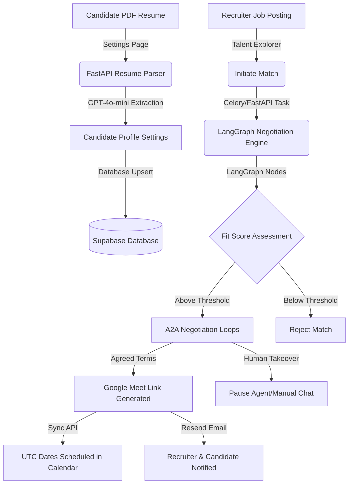

# Project Overview & Architecture: recruitx (A2A Marketplace)

recruitx is an innovative **Agent-to-Agent (A2A)** hiring marketplace. Instead of recruiters reading resumes and candidates submitting forms manually, both parties instantiate custom AI agents to coordinate, evaluate, match, and negotiate terms (such as salary, equity, and timeline constraints) dynamically. Once an agreement is reached, the agents schedule a live meeting (with video coordinates) on behalf of their human operators.

---

## 🛠️ Technology Stack

### Frontend (Next.js Application)
* **Framework**: Next.js 16 (App Router)
* **Styling**: Vanilla TailwindCSS & PostCSS (Modern sleek dark modes, vibrant HSL tailwinds, clean typography)
* **Authentication**: Supabase SSR Client (`@supabase/ssr` / `@supabase/supabase-js`)
* **Real-time Engine**: Browser WebSockets connected to FastAPI matching threads
* **Build Engine**: Webpack compiler (`next dev --webpack`)

### Backend (Python Service)
* **Framework**: FastAPI (Asynchronous endpoints, WebSocket servers)
* **Agent Framework**: LangGraph & LangChain (Managing candidate and recruiter memory graphs)
* **LLM Engine**: OpenAI GPT-4o-mini (Resume parsing, tactical negotiation iterations, and interview coaching analysis)
* **Database & Auth**: Supabase PostgreSQL client (Real-time schema, triggers, and Row Level Security)
* **Background Tasks**: Celery & Redis distributed worker pool (with asynchronous local fallback logic)
* **Notification Layer**: Resend API (Transactional HTML emails and console fallback log blocks)
* **PDF Parser**: `pypdf` (Extracting text from resume uploads)

---

## 📁 Directory Structure

```text
recruitx/
├── backend/
│   ├── agents/
│   │   ├── candidate/         # Candidate LangGraph state and routing nodes
│   │   └── recruiter/         # Recruiter LangGraph state and routing nodes
│   ├── api/
│   │   ├── auth.py
│   │   ├── candidates.py      # Resume parsing & interview coach endpoints
│   │   ├── jobs.py
│   │   ├── matching.py        # Matching scan triggers
│   │   ├── negotiations.py    # LangGraph step iterations & human takeovers
│   │   ├── notifications.py   # Resend client & ascii formatting logs
│   │   └── recruiters.py      # Talent pool explorer & manual initiation
│   ├── db/
│   │   └── client.py          # Supabase client wrapper
│   ├── tasks/
│   │   └── queue.py           # Celery application & task dispatcher
│   ├── .env                   # Environment keys (RESEND_API, OPENAI_API, etc.)
│   ├── main.py                # FastAPI app & routing mount
│   └── pyproject.toml         # Python requirements & dependencies
│
├── frontend/
│   ├── src/
│   │   ├── app/
│   │   │   ├── dashboard/
│   │   │   │   ├── candidate/ # Calendar, Analytics, Prep Room, Settings
│   │   │   │   └── recruiter/ # Candidates Pool, Analytics, Calendar, Settings
│   │   │   ├── profile/       # User Onboarding/Role Selection Page
│   │   │   ├── auth/          # Login & Signup Form
│   │   │   └── layout.tsx
│   │   ├── components/        # Sidebar, TopBar, StatCard, JobCard
│   │   ├── lib/
│   │   │   ├── api.ts         # Global API fetch client & WebSockets helper
│   │   │   └── supabase-client.ts
│   │   └── proxy.ts      # Role-based route guard edge logic
│   ├── next.config.ts
│   ├── package.json
│   └── tailwind.config.ts
```

---

## 🛰️ Core Architectures & Data Flows



### 1. The Agent-to-Agent Negotiation Engine
Negotiation iterations are handled in [backend/api/negotiations.py](file:///c:/Users/Viraj/Downloads/Nirvana/recruitx/backend/api/negotiations.py). When a match initiates:
* The candidate agent reads the candidate's verified skills, negotiation style (Firm, Flexible, Collaborative), target salary min, and equity floor limits.
* The recruiter agent reads the job requirements, max salary ceiling, and recruiter negotiation style.
* They alternate turns writing proposals into the `messages` table until they hit an agreement (triggering interview booking) or reach a stalemate (marked as rejected).

### 2. Real-time Communications (WebSockets)
* Both recruiter and candidate dashboards maintain active WebSocket sessions matching `/ws/negotiation/{room_id}`.
* When either agent executes a turn, the backend pushes JSON frames containing updated message bubbles to all connected clients instantly.

### 3. Distributed Background Processing (Celery + Redis)
* Background operations run through a dual-mode dispatcher in [backend/tasks/queue.py](file:///c:/Users/Viraj/Downloads/Nirvana/recruitx/backend/tasks/queue.py).
* When `USE_CELERY=true`, Celery workers pick up queued tasks (like matching scans and notifications) from Redis.
* If Redis is unavailable, it automatically switches to local `BackgroundTasks` execution so developer systems don't experience crashes.
